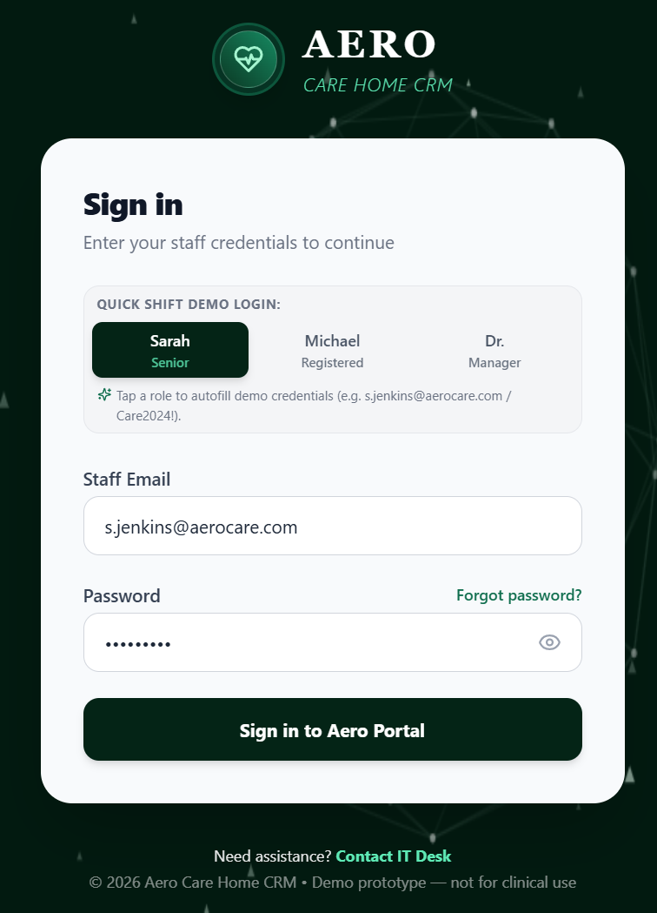

# Aero Care Home CRM

A digital care-management prototype for residential care homes: shift handover dashboards, resident
clinical profiles, an electronic MAR (eMAR) with controlled-drug dual sign-off, care logs, vitals with
NEWS2 early-warning scoring, and incident / safeguarding reporting.

Built with React 18, TypeScript, Vite, and Tailwind CSS. Data persists offline in `localStorage`.

> Demo prototype — not for clinical use. Authentication is client-side and demo-grade only; it is not
> suitable for real protected health information.

## Sign-in screen

Role-based sign-in with salted password hashing and per-role permission gating.



## Demo credentials

Tap a role on the sign-in card to autofill these credentials.

| Role             | Email                  | Password    |
| ---------------- | ---------------------- | ----------- |
| Senior Caregiver | s.jenkins@aerocare.com | `Care2024!` |
| Registered Nurse | m.vance@aerocare.com   | `Nurse2024!`|
| Manager          | e.ross@aerocare.com    | `Mgr2024!`  |

## Features

- **Shift dashboard** — handover summary, high-attention watchlist, hydration and MAR KPIs.
- **Resident directory & profiles** — demographics, care plans, dietary (IDDSI), DNACPR, NOK/GP contacts,
  care-log timeline, vitals history, and MAR administration history.
- **Electronic MAR** — timed drug rounds, administration outcomes, stock decrement, and mandatory second
  signature for Controlled Drugs (CD Schedule 2) from an authorized witness.
- **Vitals & NEWS2** — full observation set (resp. rate, SpO2, O2 supplementation, AVPU) scored against
  RCP NEWS2 thresholds with trigger breakdown.
- **Care logs & incidents** — timestamped, staff-attributed notes and CQC-style incident reporting.
- **Role-based access control** — permissions (administer meds, witness CD, record vitals, admit resident,
  manage settings, etc.) are enforced per role across the UI.

## Getting started

```bash
npm install
npm run dev      # local dev server
npm run build    # typecheck + production build
npm run lint     # typecheck only
```

## Project layout

- `src/services/auth.ts` — demo authentication, RBAC permission matrix, session persistence.
- `src/services/clinical.ts` — NEWS2 early-warning score calculator.
- `src/services/storageService.ts` — localStorage persistence layer.
- `src/components/` — dashboard, directory, profile, eMAR, logs, incidents, roster, and auth UI.
- `src/data/mockData.ts` — seeded demo residents, medications, logs, and vitals.
